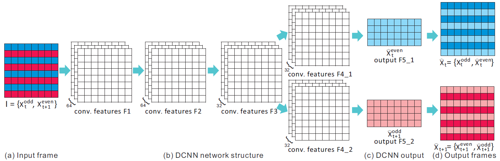
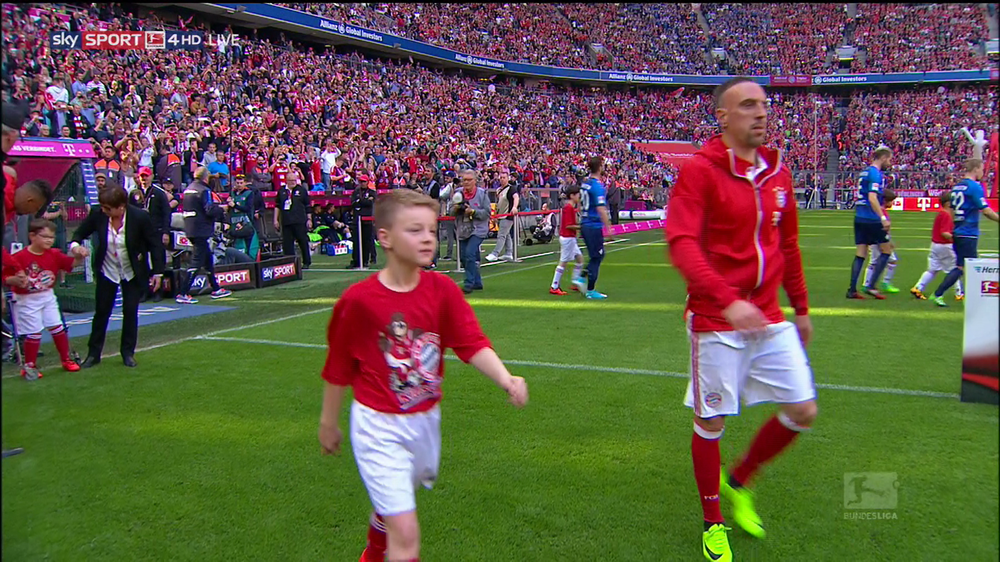

# Deep Video Deinterlacing

We run this code using Tensorflow.

### Architecture
TensorFlow Implementation of ["Real-time Deep Video Deinterlacing"](https://arxiv.org/abs/1708.00187)

<a href="http://tensorlayer.readthedocs.io">
<div align="center">
	
</div>
</a>

### Results
<div align="center">
	
</div>
<div align="center">
	
	
</div>

### Run
- Start deinterlacing
```
python runDeinterlacing.py --img_path=images/4.png
``` 

### Author
- [lszhuhaichao](https://github.com/lszhuhaichao)

### Citation
If you find this project useful, we will be grateful if you cite our paper

```
@article{zhu2017real,
  title={Real-time Deep Video Deinterlacing},
  author={Zhu, Haichao and Liu, Xueting and Mao, Xiangyu and Wong, Tien-Tsin},
  journal={arXiv preprint arXiv:1708.00187},
  year={2017}
}
```

### License
- For academic and non-commercial use only.
